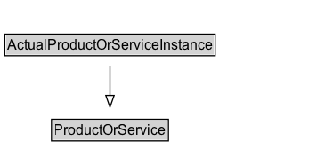

# ActualProductOrServiceInstance

## Diagram

=== "SVG (interactive)"

    <!-- Generated by graphviz version 14.0.2 (20251019.1705)
     -->
    <!-- Pages: 1 -->
    <svg width="274pt" height="132pt"
     viewBox="0.00 0.00 274.00 132.00" xmlns="http://www.w3.org/2000/svg" xmlns:xlink="http://www.w3.org/1999/xlink">
    <g id="graph0" class="graph" transform="scale(1 1) rotate(0) translate(4 128)">
    <polygon fill="white" stroke="none" points="-4,4 -4,-128 269.62,-128 269.62,4 -4,4"/>
    <g id="clust2" class="cluster">
    <title>cluster_associated</title>
    </g>
    <!-- ActualProductOrServiceInstance -->
    <g id="node1" class="node">
    <title>ActualProductOrServiceInstance</title>
    <g id="a_node1"><a xlink:href="../ActualProductOrServiceInstance" xlink:title="&lt;TABLE&gt;">
    <polygon fill="lightgray" stroke="none" points="1,-81.88 1,-98.12 176.25,-98.12 176.25,-81.88 1,-81.88"/>
    <text xml:space="preserve" text-anchor="start" x="2" y="-85.72" font-family="Arial" font-size="12.00">ActualProductOrServiceInstance</text>
    <polygon fill="none" stroke="black" points="0,-80.88 0,-99.12 177.25,-99.12 177.25,-80.88 0,-80.88"/>
    </a>
    </g>
    </g>
    <!-- ProductOrService -->
    <g id="node3" class="node">
    <title>ProductOrService</title>
    <g id="a_node3"><a xlink:href="../ProductOrService" xlink:title="&lt;TABLE&gt;">
    <polygon fill="lightgray" stroke="none" points="40.38,-9.88 40.38,-26.12 136.88,-26.12 136.88,-9.88 40.38,-9.88"/>
    <text xml:space="preserve" text-anchor="start" x="41.38" y="-13.72" font-family="Arial" font-size="12.00">ProductOrService</text>
    <polygon fill="none" stroke="black" points="39.38,-8.88 39.38,-27.12 137.88,-27.12 137.88,-8.88 39.38,-8.88"/>
    </a>
    </g>
    </g>
    <!-- ActualProductOrServiceInstance&#45;&gt;ProductOrService -->
    <g id="edge1" class="edge">
    <title>ActualProductOrServiceInstance&#45;&gt;ProductOrService</title>
    <path fill="none" stroke="black" d="M88.62,-72.05C88.62,-64.57 88.62,-55.58 88.62,-47.14"/>
    <polygon fill="none" stroke="black" points="92.13,-47.3 88.63,-37.3 85.13,-47.3 92.13,-47.3"/>
    </g>
    <!-- Invis -->
    </g>
    </svg>

=== "PNG"

    

## Formalization for ActualProductOrServiceInstance

| Property | Constraint |
|----------|------------|
| subClassOf | [ProductOrService](ProductOrService.md) |

## Other annotations

| Property | Value |
|----------|-------|
| [owl:deprecated](https://w3id.org/citydata/imported/owl/deprecated) | true |

