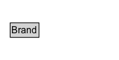

# Brand

## Diagram

=== "SVG (interactive)"

    <!-- Generated by graphviz version 14.0.2 (20251019.1705)
     -->
    <!-- Pages: 1 -->
    <svg width="150pt" height="76pt"
     viewBox="0.00 0.00 150.00 76.00" xmlns="http://www.w3.org/2000/svg" xmlns:xlink="http://www.w3.org/1999/xlink">
    <g id="graph0" class="graph" transform="scale(1 1) rotate(0) translate(4 72)">
    <polygon fill="white" stroke="none" points="-4,4 -4,-72 146,-72 146,4 -4,4"/>
    <g id="clust2" class="cluster">
    <title>cluster_associated</title>
    </g>
    <!-- Brand -->
    <g id="node1" class="node">
    <title>Brand</title>
    <g id="a_node1"><a xlink:href="../Brand" xlink:title="&lt;TABLE&gt;">
    <polygon fill="lightgray" stroke="none" points="9.88,-25.88 9.88,-42.12 44.12,-42.12 44.12,-25.88 9.88,-25.88"/>
    <text xml:space="preserve" text-anchor="start" x="10.88" y="-29.73" font-family="Arial" font-size="12.00">Brand</text>
    <polygon fill="none" stroke="black" points="8.88,-24.88 8.88,-43.12 45.12,-43.12 45.12,-24.88 8.88,-24.88"/>
    </a>
    </g>
    </g>
    <!-- Invis -->
    </g>
    </svg>

=== "PNG"

    

## Formalization for Brand

| Property | Constraint |
|----------|------------|
| disjointWith | [ProductOrService](ProductOrService.md) |
| disjointWith | [Location](Location.md) |
| disjointWith | [OpeningHoursSpecification](OpeningHoursSpecification.md) |
| disjointWith | [PriceSpecification](PriceSpecification.md) |
| disjointWith | [BusinessFunction](BusinessFunction.md) |
| disjointWith | [QuantitativeValue](QuantitativeValue.md) |
| disjointWith | [BusinessEntityType](BusinessEntityType.md) |
| disjointWith | [Offering](Offering.md) |
| disjointWith | [PaymentMethod](PaymentMethod.md) |
| disjointWith | [WarrantyPromise](WarrantyPromise.md) |
| disjointWith | [WarrantyScope](WarrantyScope.md) |
| disjointWith | [DeliveryMethod](DeliveryMethod.md) |
| disjointWith | [BusinessEntity](BusinessEntity.md) |
| disjointWith | [DayOfWeek](DayOfWeek.md) |
| disjointWith | [TypeAndQuantityNode](TypeAndQuantityNode.md) |

