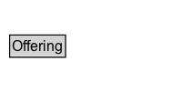

# Offering

## Diagram

=== "SVG (interactive)"

    <!-- Generated by graphviz version 14.0.2 (20251019.1705)
     -->
    <!-- Pages: 1 -->
    <svg width="150pt" height="76pt"
     viewBox="0.00 0.00 150.00 76.00" xmlns="http://www.w3.org/2000/svg" xmlns:xlink="http://www.w3.org/1999/xlink">
    <g id="graph0" class="graph" transform="scale(1 1) rotate(0) translate(4 72)">
    <polygon fill="white" stroke="none" points="-4,4 -4,-72 146,-72 146,4 -4,4"/>
    <g id="clust2" class="cluster">
    <title>cluster_associated</title>
    </g>
    <!-- Offering -->
    <g id="node1" class="node">
    <title>Offering</title>
    <g id="a_node1"><a xlink:href="../Offering" xlink:title="&lt;TABLE&gt;">
    <polygon fill="lightgray" stroke="none" points="5,-25.88 5,-42.12 49,-42.12 49,-25.88 5,-25.88"/>
    <text xml:space="preserve" text-anchor="start" x="6" y="-29.73" font-family="Arial" font-size="12.00">Offering</text>
    <polygon fill="none" stroke="black" points="4,-24.88 4,-43.12 50,-43.12 50,-24.88 4,-24.88"/>
    </a>
    </g>
    </g>
    <!-- Invis -->
    </g>
    </svg>

=== "PNG"

    

## Specializations of Offering

| Class | Description |
|-------|-------------|
| [Offer (schema1)](https://w3id.org/citydata/imported/schema1/latest/Offer) |  |

## Formalization for Offering

| Property | Constraint |
|----------|------------|
| disjointWith | [ProductOrService](ProductOrService.md) |
| disjointWith | [Location](Location.md) |
| disjointWith | [OpeningHoursSpecification](OpeningHoursSpecification.md) |
| disjointWith | [PriceSpecification](PriceSpecification.md) |
| disjointWith | [BusinessFunction](BusinessFunction.md) |
| disjointWith | [QuantitativeValue](QuantitativeValue.md) |
| disjointWith | [BusinessEntityType](BusinessEntityType.md) |
| disjointWith | [WarrantyScope](WarrantyScope.md) |
| disjointWith | [Brand](Brand.md) |
| disjointWith | [PaymentMethod](PaymentMethod.md) |
| disjointWith | [WarrantyPromise](WarrantyPromise.md) |
| disjointWith | [QualitativeValue](QualitativeValue.md) |
| disjointWith | [DeliveryMethod](DeliveryMethod.md) |
| disjointWith | [BusinessEntity](BusinessEntity.md) |
| disjointWith | [DayOfWeek](DayOfWeek.md) |
| disjointWith | [TypeAndQuantityNode](TypeAndQuantityNode.md) |

