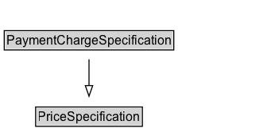

# PaymentChargeSpecification

## Diagram

=== "SVG (interactive)"

    <!-- Generated by graphviz version 14.0.2 (20251019.1705)
     -->
    <!-- Pages: 1 -->
    <svg width="256pt" height="132pt"
     viewBox="0.00 0.00 256.00 132.00" xmlns="http://www.w3.org/2000/svg" xmlns:xlink="http://www.w3.org/1999/xlink">
    <g id="graph0" class="graph" transform="scale(1 1) rotate(0) translate(4 128)">
    <polygon fill="white" stroke="none" points="-4,4 -4,-128 252,-128 252,4 -4,4"/>
    <g id="clust2" class="cluster">
    <title>cluster_associated</title>
    </g>
    <!-- PaymentChargeSpecification -->
    <g id="node1" class="node">
    <title>PaymentChargeSpecification</title>
    <g id="a_node1"><a xlink:href="../PaymentChargeSpecification" xlink:title="&lt;TABLE&gt;">
    <polygon fill="lightgray" stroke="none" points="1,-81.88 1,-98.12 159,-98.12 159,-81.88 1,-81.88"/>
    <text xml:space="preserve" text-anchor="start" x="2" y="-85.72" font-family="Arial" font-size="12.00">PaymentChargeSpecification</text>
    <polygon fill="none" stroke="black" points="0,-80.88 0,-99.12 160,-99.12 160,-80.88 0,-80.88"/>
    </a>
    </g>
    </g>
    <!-- PriceSpecification -->
    <g id="node3" class="node">
    <title>PriceSpecification</title>
    <g id="a_node3"><a xlink:href="../PriceSpecification" xlink:title="&lt;TABLE&gt;">
    <polygon fill="lightgray" stroke="none" points="30.62,-9.88 30.62,-26.12 129.38,-26.12 129.38,-9.88 30.62,-9.88"/>
    <text xml:space="preserve" text-anchor="start" x="31.62" y="-13.72" font-family="Arial" font-size="12.00">PriceSpecification</text>
    <polygon fill="none" stroke="black" points="29.62,-8.88 29.62,-27.12 130.38,-27.12 130.38,-8.88 29.62,-8.88"/>
    </a>
    </g>
    </g>
    <!-- PaymentChargeSpecification&#45;&gt;PriceSpecification -->
    <g id="edge1" class="edge">
    <title>PaymentChargeSpecification&#45;&gt;PriceSpecification</title>
    <path fill="none" stroke="black" d="M80,-72.05C80,-64.57 80,-55.58 80,-47.14"/>
    <polygon fill="none" stroke="black" points="83.5,-47.3 80,-37.3 76.5,-47.3 83.5,-47.3"/>
    </g>
    <!-- Invis -->
    </g>
    </svg>

=== "PNG"

    

## Formalization for PaymentChargeSpecification

| Property | Constraint |
|----------|------------|
| disjointWith | [UnitPriceSpecification](UnitPriceSpecification.md) |
| disjointWith | [DeliveryChargeSpecification](DeliveryChargeSpecification.md) |
| subClassOf | [PriceSpecification](PriceSpecification.md) |

