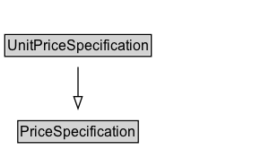

# UnitPriceSpecification

## Diagram

=== "SVG (interactive)"

    <!-- Generated by graphviz version 14.0.2 (20251019.1705)
     -->
    <!-- Pages: 1 -->
    <svg width="218pt" height="132pt"
     viewBox="0.00 0.00 218.00 132.00" xmlns="http://www.w3.org/2000/svg" xmlns:xlink="http://www.w3.org/1999/xlink">
    <g id="graph0" class="graph" transform="scale(1 1) rotate(0) translate(4 128)">
    <polygon fill="white" stroke="none" points="-4,4 -4,-128 214.25,-128 214.25,4 -4,4"/>
    <g id="clust2" class="cluster">
    <title>cluster_associated</title>
    </g>
    <!-- UnitPriceSpecification -->
    <g id="node1" class="node">
    <title>UnitPriceSpecification</title>
    <g id="a_node1"><a xlink:href="../UnitPriceSpecification" xlink:title="&lt;TABLE&gt;">
    <polygon fill="lightgray" stroke="none" points="1,-81.88 1,-98.12 121.5,-98.12 121.5,-81.88 1,-81.88"/>
    <text xml:space="preserve" text-anchor="start" x="2" y="-85.72" font-family="Arial" font-size="12.00">UnitPriceSpecification</text>
    <polygon fill="none" stroke="black" points="0,-80.88 0,-99.12 122.5,-99.12 122.5,-80.88 0,-80.88"/>
    </a>
    </g>
    </g>
    <!-- PriceSpecification -->
    <g id="node3" class="node">
    <title>PriceSpecification</title>
    <g id="a_node3"><a xlink:href="../PriceSpecification" xlink:title="&lt;TABLE&gt;">
    <polygon fill="lightgray" stroke="none" points="11.88,-9.88 11.88,-26.12 110.62,-26.12 110.62,-9.88 11.88,-9.88"/>
    <text xml:space="preserve" text-anchor="start" x="12.88" y="-13.72" font-family="Arial" font-size="12.00">PriceSpecification</text>
    <polygon fill="none" stroke="black" points="10.88,-8.88 10.88,-27.12 111.62,-27.12 111.62,-8.88 10.88,-8.88"/>
    </a>
    </g>
    </g>
    <!-- UnitPriceSpecification&#45;&gt;PriceSpecification -->
    <g id="edge1" class="edge">
    <title>UnitPriceSpecification&#45;&gt;PriceSpecification</title>
    <path fill="none" stroke="black" d="M61.25,-72.05C61.25,-64.57 61.25,-55.58 61.25,-47.14"/>
    <polygon fill="none" stroke="black" points="64.75,-47.3 61.25,-37.3 57.75,-47.3 64.75,-47.3"/>
    </g>
    <!-- Invis -->
    </g>
    </svg>

=== "PNG"

    

## Formalization for UnitPriceSpecification

| Property | Constraint |
|----------|------------|
| disjointWith | [PaymentChargeSpecification](PaymentChargeSpecification.md) |
| disjointWith | [DeliveryChargeSpecification](DeliveryChargeSpecification.md) |
| subClassOf | [PriceSpecification](PriceSpecification.md) |

