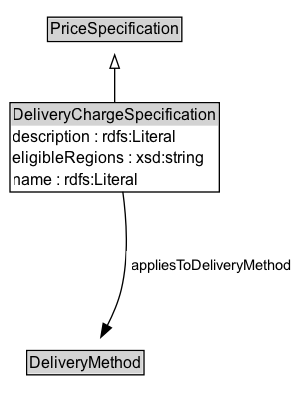

# DeliveryChargeSpecification

A delivery charge specification is a conceptual entity that specifies the additional costs asked for the delivery of a given gr:Offering using a particular gr:DeliveryMethod by the respective gr:BusinessEntity. A delivery charge specification is characterized by (1) a monetary amount per order, specified as a literal value of type float in combination with a currency, (2) the delivery method, (3) the target country or region, and (4)  whether this charge includes local sales taxes, namely VAT.
A gr:Offering may be linked to multiple gr:DeliveryChargeSpecification nodes that specify alternative charges for disjoint combinations of target countries or regions, and delivery methods.

Examples: Delivery by direct download is free of charge worldwide, delivery by UPS to Germany is 10 Euros per order, delivery by mail within the US is 5 Euros per order.

The total amount of this charge is specified as a float value of the gr:hasCurrencyValue property. The currency is specified via the gr:hasCurrency datatype property. Whether the price includes VAT or not is indicated by the gr:valueAddedTaxIncluded property. The gr:DeliveryMethod to which this charge applies is specified using the gr:appliesToDeliveryMethod object property. The region or regions to which this charge applies is specified using the gr:eligibleRegions property, which uses ISO 3166-1 and ISO 3166-2 codes.

If the price can only be given as a range, use gr:hasMaxCurrencyValue and gr:hasMinCurrencyValue for the upper and lower bounds.

Important: When querying for the price, always use gr:hasMaxCurrencyValue and gr:hasMinCurrencyValue.

## Diagram

=== "SVG (interactive)"

    <!-- Generated by graphviz version 14.1.3 (20260303.0454)
     -->
    <!-- Pages: 1 -->
    <svg width="227pt" height="310pt"
     viewBox="0.00 0.00 227.00 310.00" xmlns="http://www.w3.org/2000/svg" xmlns:xlink="http://www.w3.org/1999/xlink">
    <g id="graph0" class="graph" transform="scale(1 1) rotate(0) translate(4 306)">
    <polygon fill="white" stroke="none" points="-4,4 -4,-306 222.77,-306 222.77,4 -4,4"/>
    <g id="clust3" class="cluster">
    <title>cluster_associated</title>
    </g>
    <!-- PriceSpecification -->
    <g id="node1" class="node">
    <title>PriceSpecification</title>
    <g id="a_node1"><a xlink:href="../PriceSpecification" xlink:title="&lt;TABLE&gt;">
    <polygon fill="lightgray" stroke="none" points="32.62,-275.88 32.62,-292.12 131.38,-292.12 131.38,-275.88 32.62,-275.88"/>
    <text xml:space="preserve" text-anchor="start" x="33.62" y="-279.88" font-family="Arial" font-size="12.00">PriceSpecification</text>
    <polygon fill="none" stroke="black" points="31.62,-274.88 31.62,-293.12 132.38,-293.12 132.38,-274.88 31.62,-274.88"/>
    </a>
    </g>
    </g>
    <!-- DeliveryChargeSpecification -->
    <g id="node2" class="node">
    <title>DeliveryChargeSpecification</title>
    <g id="a_node2"><a xlink:href="../DeliveryChargeSpecification" xlink:title="&lt;TABLE&gt;">
    <polygon fill="lightgray" stroke="none" points="4.5,-211.75 4.5,-228 159.5,-228 159.5,-211.75 4.5,-211.75"/>
    <text xml:space="preserve" text-anchor="start" x="5.5" y="-215.75" font-family="Arial" font-size="12.00">DeliveryChargeSpecification</text>
    <text xml:space="preserve" text-anchor="start" x="5.5" y="-199.5" font-family="Arial" font-size="12.00">description : rdfs:Literal</text>
    <text xml:space="preserve" text-anchor="start" x="5.5" y="-183.25" font-family="Arial" font-size="12.00">eligibleRegions : xsd:string</text>
    <text xml:space="preserve" text-anchor="start" x="5.5" y="-167" font-family="Arial" font-size="12.00">name : rdfs:Literal</text>
    <polygon fill="none" stroke="black" points="3.5,-162 3.5,-229 160.5,-229 160.5,-162 3.5,-162"/>
    </a>
    </g>
    </g>
    <!-- DeliveryChargeSpecification&#45;&gt;PriceSpecification -->
    <g id="edge1" class="edge">
    <title>DeliveryChargeSpecification&#45;&gt;PriceSpecification</title>
    <path fill="none" stroke="black" d="M82,-228.89C82,-237.45 82,-246.62 82,-254.93"/>
    <polygon fill="none" stroke="black" points="78.5,-254.81 82,-264.81 85.5,-254.81 78.5,-254.81"/>
    </g>
    <!-- Invis -->
    <!-- DeliveryChargeSpecification&#45;&gt;Invis -->
    <!-- DeliveryMethod -->
    <g id="node4" class="node">
    <title>DeliveryMethod</title>
    <g id="a_node4"><a xlink:href="../DeliveryMethod" xlink:title="&lt;TABLE&gt;">
    <polygon fill="lightgray" stroke="none" points="17,-25.88 17,-42.12 103,-42.12 103,-25.88 17,-25.88"/>
    <text xml:space="preserve" text-anchor="start" x="18" y="-29.88" font-family="Arial" font-size="12.00">DeliveryMethod</text>
    <polygon fill="none" stroke="black" points="16,-24.88 16,-43.12 104,-43.12 104,-24.88 16,-24.88"/>
    </a>
    </g>
    </g>
    <!-- DeliveryChargeSpecification&#45;&gt;DeliveryMethod -->
    <g id="edge4" class="edge">
    <title>DeliveryChargeSpecification&#45;&gt;DeliveryMethod</title>
    <path fill="none" stroke="black" d="M88.11,-162.22C90.99,-141.11 92.69,-113.09 87,-89 84.8,-79.68 80.73,-70.13 76.4,-61.7"/>
    <polygon fill="black" stroke="black" points="79.53,-60.12 71.64,-53.06 73.4,-63.5 79.53,-60.12"/>
    <polygon fill="white" stroke="none" points="90.77,-96.25 90.77,-117.75 218.77,-117.75 218.77,-96.25 90.77,-96.25"/>
    <text xml:space="preserve" text-anchor="start" x="94.77" y="-103.25" font-family="Arial" font-size="11.00">appliesToDeliveryMethod</text>
    </g>
    <!-- Invis&#45;&gt;DeliveryMethod -->
    </g>
    </svg>

=== "PNG"

    

## Formalization for DeliveryChargeSpecification

| Property | Constraint |
|----------|------------|
| [appliesToDeliveryMethod](../properties/appliesToDeliveryMethod.md) | only [DeliveryMethod](http://purl.org/goodrelations/v1/DeliveryMethod) |
| [description](../properties/description.md) | datatype rdfs:Literal |
| [eligibleRegions](../properties/eligibleRegions.md) | datatype xsd:string |
| [name](../properties/name.md) | datatype rdfs:Literal |
| disjointWith | [PaymentChargeSpecification](PaymentChargeSpecification.md) |
| disjointWith | [UnitPriceSpecification](UnitPriceSpecification.md) |
| subClassOf | [PriceSpecification](PriceSpecification.md) |

