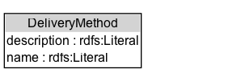

# DeliveryMethod

A delivery method is a standardized procedure for transferring the product or service to the destination of fulfilment chosen by the customer. Delivery methods are characterized by the means of transportation used, and by the organization or group that is the contracting party for the sending gr:BusinessEntity (this is important, since the contracted party may subcontract the fulfilment to smaller, regional businesses).

Examples: Delivery by mail, delivery by direct download, delivery by UPS

## Diagram

=== "SVG (interactive)"

    <!-- Generated by graphviz version 14.1.3 (20260303.0454)
     -->
    <!-- Pages: 1 -->
    <svg width="224pt" height="76pt"
     viewBox="0.00 0.00 224.00 76.00" xmlns="http://www.w3.org/2000/svg" xmlns:xlink="http://www.w3.org/1999/xlink">
    <g id="graph0" class="graph" transform="scale(1 1) rotate(0) translate(4 72)">
    <polygon fill="white" stroke="none" points="-4,4 -4,-72 219.5,-72 219.5,4 -4,4"/>
    <g id="clust3" class="cluster">
    <title>cluster_associated</title>
    </g>
    <!-- DeliveryMethod -->
    <g id="node1" class="node">
    <title>DeliveryMethod</title>
    <g id="a_node1"><a xlink:href="../DeliveryMethod" xlink:title="&lt;TABLE&gt;">
    <polygon fill="lightgray" stroke="none" points="1,-42.12 1,-58.38 126,-58.38 126,-42.12 1,-42.12"/>
    <text xml:space="preserve" text-anchor="start" x="21.5" y="-46.12" font-family="Arial" font-size="12.00">DeliveryMethod</text>
    <text xml:space="preserve" text-anchor="start" x="2" y="-29.88" font-family="Arial" font-size="12.00">description : rdfs:Literal</text>
    <text xml:space="preserve" text-anchor="start" x="2" y="-13.62" font-family="Arial" font-size="12.00">name : rdfs:Literal</text>
    <polygon fill="none" stroke="black" points="0,-8.62 0,-59.38 127,-59.38 127,-8.62 0,-8.62"/>
    </a>
    </g>
    </g>
    <!-- Invis -->
    </g>
    </svg>

=== "PNG"

    

## Specializations of DeliveryMethod

| Class | Description |
|-------|-------------|
| [Delivery Mode Parcel Service](DeliveryModeParcelService.md) | A private parcel service as the delivery mode available for a certain offering.

Examples: UPS, DHL |

## Formalization for DeliveryMethod

| Property | Constraint |
|----------|------------|
| [description](../properties/description.md) | datatype rdfs:Literal |
| [name](../properties/name.md) | datatype rdfs:Literal |
| disjointWith | [Brand](Brand.md) |
| disjointWith | [BusinessEntity](BusinessEntity.md) |
| disjointWith | [BusinessEntityType](BusinessEntityType.md) |
| disjointWith | [BusinessFunction](BusinessFunction.md) |
| disjointWith | [DayOfWeek](DayOfWeek.md) |
| disjointWith | [Location](Location.md) |
| disjointWith | [Offering](Offering.md) |
| disjointWith | [OpeningHoursSpecification](OpeningHoursSpecification.md) |
| disjointWith | [PaymentMethod](PaymentMethod.md) |
| disjointWith | [PriceSpecification](PriceSpecification.md) |
| disjointWith | [ProductOrService](ProductOrService.md) |
| disjointWith | [QuantitativeValue](QuantitativeValue.md) |
| disjointWith | [TypeAndQuantityNode](TypeAndQuantityNode.md) |
| disjointWith | [WarrantyPromise](WarrantyPromise.md) |
| disjointWith | [WarrantyScope](WarrantyScope.md) |

