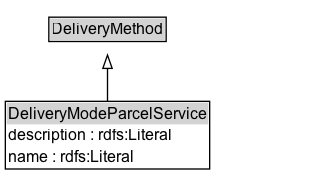

# DeliveryModeParcelService

A private parcel service as the delivery mode available for a certain offering.

Examples: UPS, DHL

## Diagram

=== "SVG (interactive)"

    <!-- Generated by graphviz version 14.1.3 (20260303.0454)
     -->
    <!-- Pages: 1 -->
    <svg width="250pt" height="139pt"
     viewBox="0.00 0.00 250.00 139.00" xmlns="http://www.w3.org/2000/svg" xmlns:xlink="http://www.w3.org/1999/xlink">
    <g id="graph0" class="graph" transform="scale(1 1) rotate(0) translate(4 135.38)">
    <polygon fill="white" stroke="none" points="-4,4 -4,-135.38 245.62,-135.38 245.62,4 -4,4"/>
    <g id="clust3" class="cluster">
    <title>cluster_associated</title>
    </g>
    <!-- DeliveryMethod -->
    <g id="node1" class="node">
    <title>DeliveryMethod</title>
    <g id="a_node1"><a xlink:href="../DeliveryMethod" xlink:title="&lt;TABLE&gt;">
    <polygon fill="lightgray" stroke="none" points="33.62,-105.25 33.62,-121.5 119.62,-121.5 119.62,-105.25 33.62,-105.25"/>
    <text xml:space="preserve" text-anchor="start" x="34.62" y="-109.25" font-family="Arial" font-size="12.00">DeliveryMethod</text>
    <polygon fill="none" stroke="black" points="32.62,-104.25 32.62,-122.5 120.62,-122.5 120.62,-104.25 32.62,-104.25"/>
    </a>
    </g>
    </g>
    <!-- DeliveryModeParcelService -->
    <g id="node2" class="node">
    <title>DeliveryModeParcelService</title>
    <g id="a_node2"><a xlink:href="../DeliveryModeParcelService" xlink:title="&lt;TABLE&gt;">
    <polygon fill="lightgray" stroke="none" points="1,-42.12 1,-58.38 152.25,-58.38 152.25,-42.12 1,-42.12"/>
    <text xml:space="preserve" text-anchor="start" x="2" y="-46.12" font-family="Arial" font-size="12.00">DeliveryModeParcelService</text>
    <text xml:space="preserve" text-anchor="start" x="2" y="-29.88" font-family="Arial" font-size="12.00">description : rdfs:Literal</text>
    <text xml:space="preserve" text-anchor="start" x="2" y="-13.62" font-family="Arial" font-size="12.00">name : rdfs:Literal</text>
    <polygon fill="none" stroke="black" points="0,-8.62 0,-59.38 153.25,-59.38 153.25,-8.62 0,-8.62"/>
    </a>
    </g>
    </g>
    <!-- DeliveryModeParcelService&#45;&gt;DeliveryMethod -->
    <g id="edge1" class="edge">
    <title>DeliveryModeParcelService&#45;&gt;DeliveryMethod</title>
    <path fill="none" stroke="black" d="M76.62,-59.1C76.62,-67.05 76.62,-75.97 76.62,-84.21"/>
    <polygon fill="none" stroke="black" points="73.13,-84.07 76.63,-94.07 80.13,-84.07 73.13,-84.07"/>
    </g>
    <!-- Invis -->
    </g>
    </svg>

=== "PNG"

    

## Formalization for DeliveryModeParcelService

| Property | Constraint |
|----------|------------|
| [description](../properties/description.md) | datatype rdfs:Literal |
| [name](../properties/name.md) | datatype rdfs:Literal |
| subClassOf | [DeliveryMethod](DeliveryMethod.md) |

