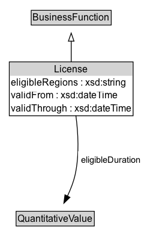

# License

A license is the specification of a bundle of rights that determines the type of activity or access offered by the gr:BusinessEntity on the gr:ProductOrService through the gr:Offering.
	
Licenses can be standardized (e.g. LPGL, Creative Commons, ...), vendor-specific, or individually defined for a single offer or product. Whether there is a fee for obtaining the license is specified using the gr:UnitPriceSpecification attached to the gr:Offering. Use foaf:page for linking to a document containing the license, e.g. in PDF or HTML.

## Diagram

=== "SVG (interactive)"

    <!-- Generated by graphviz version 14.1.3 (20260303.0454)
     -->
    <!-- Pages: 1 -->
    <svg width="184pt" height="310pt"
     viewBox="0.00 0.00 184.00 310.00" xmlns="http://www.w3.org/2000/svg" xmlns:xlink="http://www.w3.org/1999/xlink">
    <g id="graph0" class="graph" transform="scale(1 1) rotate(0) translate(4 306)">
    <polygon fill="white" stroke="none" points="-4,4 -4,-306 179.73,-306 179.73,4 -4,4"/>
    <g id="clust3" class="cluster">
    <title>cluster_associated</title>
    </g>
    <!-- BusinessFunction -->
    <g id="node1" class="node">
    <title>BusinessFunction</title>
    <g id="a_node1"><a xlink:href="../BusinessFunction" xlink:title="&lt;TABLE&gt;">
    <polygon fill="lightgray" stroke="none" points="36,-275.88 36,-292.12 134,-292.12 134,-275.88 36,-275.88"/>
    <text xml:space="preserve" text-anchor="start" x="37" y="-279.88" font-family="Arial" font-size="12.00">BusinessFunction</text>
    <polygon fill="none" stroke="black" points="35,-274.88 35,-293.12 135,-293.12 135,-274.88 35,-274.88"/>
    </a>
    </g>
    </g>
    <!-- License -->
    <g id="node2" class="node">
    <title>License</title>
    <g id="a_node2"><a xlink:href="../License" xlink:title="&lt;TABLE&gt;">
    <polygon fill="lightgray" stroke="none" points="8.62,-211.75 8.62,-228 161.38,-228 161.38,-211.75 8.62,-211.75"/>
    <text xml:space="preserve" text-anchor="start" x="64" y="-215.75" font-family="Arial" font-size="12.00">License</text>
    <text xml:space="preserve" text-anchor="start" x="9.62" y="-199.5" font-family="Arial" font-size="12.00">eligibleRegions : xsd:string</text>
    <text xml:space="preserve" text-anchor="start" x="9.62" y="-183.25" font-family="Arial" font-size="12.00">validFrom : xsd:dateTime</text>
    <text xml:space="preserve" text-anchor="start" x="9.62" y="-167" font-family="Arial" font-size="12.00">validThrough : xsd:dateTime</text>
    <polygon fill="none" stroke="black" points="7.62,-162 7.62,-229 162.38,-229 162.38,-162 7.62,-162"/>
    </a>
    </g>
    </g>
    <!-- License&#45;&gt;BusinessFunction -->
    <g id="edge1" class="edge">
    <title>License&#45;&gt;BusinessFunction</title>
    <path fill="none" stroke="black" d="M85,-228.89C85,-237.45 85,-246.62 85,-254.93"/>
    <polygon fill="none" stroke="black" points="81.5,-254.81 85,-264.81 88.5,-254.81 81.5,-254.81"/>
    </g>
    <!-- Invis -->
    <!-- License&#45;&gt;Invis -->
    <!-- QuantitativeValue -->
    <g id="node4" class="node">
    <title>QuantitativeValue</title>
    <g id="a_node4"><a xlink:href="../QuantitativeValue" xlink:title="&lt;TABLE&gt;">
    <polygon fill="lightgray" stroke="none" points="17.12,-25.88 17.12,-42.12 112.88,-42.12 112.88,-25.88 17.12,-25.88"/>
    <text xml:space="preserve" text-anchor="start" x="18.12" y="-29.88" font-family="Arial" font-size="12.00">QuantitativeValue</text>
    <polygon fill="none" stroke="black" points="16.12,-24.88 16.12,-43.12 113.88,-43.12 113.88,-24.88 16.12,-24.88"/>
    </a>
    </g>
    </g>
    <!-- License&#45;&gt;QuantitativeValue -->
    <g id="edge4" class="edge">
    <title>License&#45;&gt;QuantitativeValue</title>
    <path fill="none" stroke="black" d="M90.86,-162.28C93.64,-141.19 95.32,-113.17 90,-89 87.97,-79.78 84.2,-70.26 80.2,-61.83"/>
    <polygon fill="black" stroke="black" points="83.45,-60.51 75.79,-53.18 77.21,-63.68 83.45,-60.51"/>
    <polygon fill="white" stroke="none" points="93.48,-96.25 93.48,-117.75 175.73,-117.75 175.73,-96.25 93.48,-96.25"/>
    <text xml:space="preserve" text-anchor="start" x="97.48" y="-103.25" font-family="Arial" font-size="11.00">eligibleDuration</text>
    </g>
    <!-- Invis&#45;&gt;QuantitativeValue -->
    </g>
    </svg>

=== "PNG"

    

## Formalization for License

| Property | Constraint |
|----------|------------|
| [eligibleDuration](../properties/eligibleDuration.md) | only [QuantitativeValue](http://purl.org/goodrelations/v1/QuantitativeValue) |
| [eligibleRegions](../properties/eligibleRegions.md) | datatype xsd:string |
| [validFrom](../properties/validFrom.md) | datatype xsd:dateTime |
| [validThrough](../properties/validThrough.md) | datatype xsd:dateTime |
| subClassOf | [BusinessFunction](BusinessFunction.md) |

