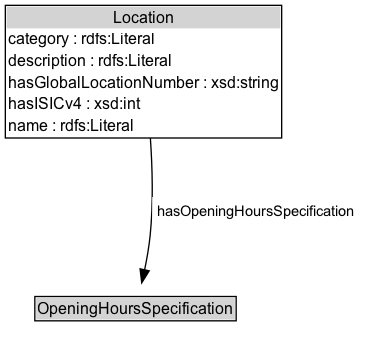

# Location

A location is a point or area of interest from which a particular product or service is available, e.g. a store, a bus stop, a gas station, or a ticket booth. The difference to gr:BusinessEntity is that the gr:BusinessEntity is the legal entity (e.g. a person or corporation) making the offer, while gr:Location is the store, office, or place. A chain restaurant will e.g. have one legal entity but multiple restaurant locations. Locations are characterized by an address or geographical position and a set of opening hour specifications for various days of the week.
		
Example: A rental car company may offer the Business Function Lease Out of cars from two locations, one in Fort Myers, Florida, and one in Boston, Massachussetts. Both stations are open 7:00 - 23:00 Mondays through Saturdays.

Note: Typical address standards (vcard) and location data (geo, WGC84) should be attached to a gr:Location node. Since there already exist established vocabularies for this, the GoodRelations ontology does not provide respective attributes. Instead, the use of respective vocabularies is recommended. However, the gr:hasGlobalLocationNumber property is  provided for linking to public identifiers for business locations.
		
Compatibility with schema.org: This class is equivalent to http://schema.org/Place.

## Diagram

=== "SVG (interactive)"

    <!-- Generated by graphviz version 14.1.3 (20260303.0454)
     -->
    <!-- Pages: 1 -->
    <svg width="274pt" height="270pt"
     viewBox="0.00 0.00 274.00 270.00" xmlns="http://www.w3.org/2000/svg" xmlns:xlink="http://www.w3.org/1999/xlink">
    <g id="graph0" class="graph" transform="scale(1 1) rotate(0) translate(4 265.5)">
    <polygon fill="white" stroke="none" points="-4,4 -4,-265.5 269.94,-265.5 269.94,4 -4,4"/>
    <g id="clust3" class="cluster">
    <title>cluster_associated</title>
    </g>
    <!-- Location -->
    <g id="node1" class="node">
    <title>Location</title>
    <g id="a_node1"><a xlink:href="../Location" xlink:title="&lt;TABLE&gt;">
    <polygon fill="lightgray" stroke="none" points="1,-244.25 1,-260.5 206.25,-260.5 206.25,-244.25 1,-244.25"/>
    <text xml:space="preserve" text-anchor="start" x="80.75" y="-248.25" font-family="Arial" font-size="12.00">Location</text>
    <text xml:space="preserve" text-anchor="start" x="2" y="-232" font-family="Arial" font-size="12.00">category : rdfs:Literal</text>
    <text xml:space="preserve" text-anchor="start" x="2" y="-215.75" font-family="Arial" font-size="12.00">description : rdfs:Literal</text>
    <text xml:space="preserve" text-anchor="start" x="2" y="-199.5" font-family="Arial" font-size="12.00">hasGlobalLocationNumber : xsd:string</text>
    <text xml:space="preserve" text-anchor="start" x="2" y="-183.25" font-family="Arial" font-size="12.00">hasISICv4 : xsd:int</text>
    <text xml:space="preserve" text-anchor="start" x="2" y="-167" font-family="Arial" font-size="12.00">name : rdfs:Literal</text>
    <polygon fill="none" stroke="black" points="0,-162 0,-261.5 207.25,-261.5 207.25,-162 0,-162"/>
    </a>
    </g>
    </g>
    <!-- Invis -->
    <!-- Location&#45;&gt;Invis -->
    <!-- OpeningHoursSpecification -->
    <g id="node3" class="node">
    <title>OpeningHoursSpecification</title>
    <g id="a_node3"><a xlink:href="../OpeningHoursSpecification" xlink:title="&lt;TABLE&gt;">
    <polygon fill="lightgray" stroke="none" points="23.12,-25.88 23.12,-42.12 172.12,-42.12 172.12,-25.88 23.12,-25.88"/>
    <text xml:space="preserve" text-anchor="start" x="24.12" y="-29.88" font-family="Arial" font-size="12.00">OpeningHoursSpecification</text>
    <polygon fill="none" stroke="black" points="22.12,-24.88 22.12,-43.12 173.12,-43.12 173.12,-24.88 22.12,-24.88"/>
    </a>
    </g>
    </g>
    <!-- Location&#45;&gt;OpeningHoursSpecification -->
    <g id="edge3" class="edge">
    <title>Location&#45;&gt;OpeningHoursSpecification</title>
    <path fill="none" stroke="black" d="M108.77,-162.08C110.32,-139.76 111.04,-113 108.62,-89 107.76,-80.46 106.16,-71.27 104.43,-62.94"/>
    <polygon fill="black" stroke="black" points="107.89,-62.37 102.3,-53.37 101.05,-63.89 107.89,-62.37"/>
    <polygon fill="white" stroke="none" points="110.19,-96.25 110.19,-117.75 265.94,-117.75 265.94,-96.25 110.19,-96.25"/>
    <text xml:space="preserve" text-anchor="start" x="114.19" y="-103.25" font-family="Arial" font-size="11.00">hasOpeningHoursSpecification</text>
    </g>
    <!-- Invis&#45;&gt;OpeningHoursSpecification -->
    </g>
    </svg>

=== "PNG"

    

## Formalization for Location

| Property | Constraint |
|----------|------------|
| [category](../properties/category.md) | datatype rdfs:Literal |
| [description](../properties/description.md) | datatype rdfs:Literal |
| [hasGlobalLocationNumber](../properties/hasGlobalLocationNumber.md) | datatype xsd:string |
| [hasISICv4](../properties/hasISICv4.md) | datatype xsd:int |
| [hasOpeningHoursSpecification](../properties/hasOpeningHoursSpecification.md) | only [OpeningHoursSpecification](http://purl.org/goodrelations/v1/OpeningHoursSpecification) |
| [name](../properties/name.md) | datatype rdfs:Literal |
| disjointWith | [Brand](Brand.md) |
| disjointWith | [BusinessEntity](BusinessEntity.md) |
| disjointWith | [BusinessEntityType](BusinessEntityType.md) |
| disjointWith | [BusinessFunction](BusinessFunction.md) |
| disjointWith | [DayOfWeek](DayOfWeek.md) |
| disjointWith | [DeliveryMethod](DeliveryMethod.md) |
| disjointWith | [Offering](Offering.md) |
| disjointWith | [OpeningHoursSpecification](OpeningHoursSpecification.md) |
| disjointWith | [PaymentMethod](PaymentMethod.md) |
| disjointWith | [PriceSpecification](PriceSpecification.md) |
| disjointWith | [QuantitativeValue](QuantitativeValue.md) |
| disjointWith | [TypeAndQuantityNode](TypeAndQuantityNode.md) |
| disjointWith | [WarrantyPromise](WarrantyPromise.md) |
| disjointWith | [WarrantyScope](WarrantyScope.md) |

