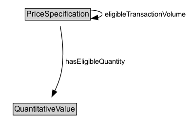

# PriceSpecification

The superclass of all price specifications.

## Diagram

=== "SVG (interactive)"

    <!-- Generated by graphviz version 14.1.3 (20260303.0454)
     -->
    <!-- Pages: 1 -->
    <svg width="294pt" height="206pt"
     viewBox="0.00 0.00 294.00 206.00" xmlns="http://www.w3.org/2000/svg" xmlns:xlink="http://www.w3.org/1999/xlink">
    <g id="graph0" class="graph" transform="scale(1 1) rotate(0) translate(4 202)">
    <polygon fill="white" stroke="none" points="-4,4 -4,-202 289.88,-202 289.88,4 -4,4"/>
    <g id="clust3" class="cluster">
    <title>cluster_associated</title>
    </g>
    <!-- PriceSpecification -->
    <g id="node1" class="node">
    <title>PriceSpecification</title>
    <g id="a_node1"><a xlink:href="../PriceSpecification" xlink:title="&lt;TABLE&gt;">
    <polygon fill="lightgray" stroke="none" points="35.62,-171.88 35.62,-188.12 134.38,-188.12 134.38,-171.88 35.62,-171.88"/>
    <text xml:space="preserve" text-anchor="start" x="36.62" y="-175.88" font-family="Arial" font-size="12.00">PriceSpecification</text>
    <polygon fill="none" stroke="black" points="34.62,-170.88 34.62,-189.12 135.38,-189.12 135.38,-170.88 34.62,-170.88"/>
    </a>
    </g>
    </g>
    <!-- PriceSpecification&#45;&gt;PriceSpecification -->
    <g id="edge3" class="edge">
    <title>PriceSpecification&#45;&gt;PriceSpecification</title>
    <path fill="none" stroke="black" d="M135.09,-186.62C145.71,-185.95 153.38,-183.74 153.38,-180 153.38,-177.78 150.67,-176.1 146.25,-174.96"/>
    <polygon fill="black" stroke="black" points="146.98,-171.52 136.59,-173.59 146,-178.46 146.98,-171.52"/>
    <polygon fill="white" stroke="none" points="153.38,-169.25 153.38,-190.75 285.88,-190.75 285.88,-169.25 153.38,-169.25"/>
    <text xml:space="preserve" text-anchor="start" x="157.38" y="-176.25" font-family="Arial" font-size="11.00">eligibleTransactionVolume</text>
    </g>
    <!-- Invis -->
    <!-- PriceSpecification&#45;&gt;Invis -->
    <!-- QuantitativeValue -->
    <g id="node3" class="node">
    <title>QuantitativeValue</title>
    <g id="a_node3"><a xlink:href="../QuantitativeValue" xlink:title="&lt;TABLE&gt;">
    <polygon fill="lightgray" stroke="none" points="17.12,-25.88 17.12,-42.12 112.88,-42.12 112.88,-25.88 17.12,-25.88"/>
    <text xml:space="preserve" text-anchor="start" x="18.12" y="-29.88" font-family="Arial" font-size="12.00">QuantitativeValue</text>
    <polygon fill="none" stroke="black" points="16.12,-24.88 16.12,-43.12 113.88,-43.12 113.88,-24.88 16.12,-24.88"/>
    </a>
    </g>
    </g>
    <!-- PriceSpecification&#45;&gt;QuantitativeValue -->
    <g id="edge4" class="edge">
    <title>PriceSpecification&#45;&gt;QuantitativeValue</title>
    <path fill="none" stroke="black" d="M88.61,-162.19C91.92,-143.95 95.52,-114.06 90,-89 87.97,-79.78 84.2,-70.26 80.2,-61.83"/>
    <polygon fill="black" stroke="black" points="83.45,-60.51 75.79,-53.18 77.21,-63.68 83.45,-60.51"/>
    <polygon fill="white" stroke="none" points="92.86,-96.25 92.86,-117.75 192.36,-117.75 192.36,-96.25 92.86,-96.25"/>
    <text xml:space="preserve" text-anchor="start" x="96.86" y="-103.25" font-family="Arial" font-size="11.00">hasEligibleQuantity</text>
    </g>
    <!-- Invis&#45;&gt;QuantitativeValue -->
    </g>
    </svg>

=== "PNG"

    

## Specializations of PriceSpecification

| Class | Description |
|-------|-------------|
| [Delivery Charge Specification](DeliveryChargeSpecification.md) | A delivery charge specification is a conceptual entity that specifies the additional costs asked for the delivery of a given gr:Offering using a particular gr:DeliveryMethod by the respective gr:BusinessEntity. A delivery charge specification is characterized by (1) a monetary amount per order, specified as a literal value of type float in combination with a currency, (2) the delivery method, (3) the target country or region, and (4)  whether this charge includes local sales taxes, namely VAT.
A gr:Offering may be linked to multiple gr:DeliveryChargeSpecification nodes that specify alternative charges for disjoint combinations of target countries or regions, and delivery methods.

Examples: Delivery by direct download is free of charge worldwide, delivery by UPS to Germany is 10 Euros per order, delivery by mail within the US is 5 Euros per order.

The total amount of this charge is specified as a float value of the gr:hasCurrencyValue property. The currency is specified via the gr:hasCurrency datatype property. Whether the price includes VAT or not is indicated by the gr:valueAddedTaxIncluded property. The gr:DeliveryMethod to which this charge applies is specified using the gr:appliesToDeliveryMethod object property. The region or regions to which this charge applies is specified using the gr:eligibleRegions property, which uses ISO 3166-1 and ISO 3166-2 codes.

If the price can only be given as a range, use gr:hasMaxCurrencyValue and gr:hasMinCurrencyValue for the upper and lower bounds.

Important: When querying for the price, always use gr:hasMaxCurrencyValue and gr:hasMinCurrencyValue. |
| [Payment Charge Specification](PaymentChargeSpecification.md) | A payment charge specification is a conceptual entity that specifies the additional costs asked for settling the payment after accepting a given gr:Offering using a particular gr:PaymentMethod. A payment charge specification is characterized by (1) a monetary amount per order specified as a literal value of type float in combination with a Currency, (2) the payment method, and (3) a whether this charge includes local sales taxes, namely VAT.
A gr:Offering may be linked to multiple payment charge specifications that specify alternative charges for various payment methods.

Examples: Payment by VISA or Mastercard costs a fee of 3 Euros including VAT, payment by bank transfer in advance is free of charge.

The total amount of this surcharge is specified as a float value of the gr:hasCurrencyValue property. The currency is specified via the gr:hasCurrency datatype property. Whether the price includes VAT or not is indicated by the gr:valueAddedTaxIncluded datatype property. The gr:PaymentMethod to which this charge applies is specified using the gr:appliesToPaymentMethod object property.

If the price can only be given as a range, use gr:hasMaxCurrencyValue and gr:hasMinCurrencyValue for the upper and lower bounds.

Important: When querying for the price, always use gr:hasMaxCurrencyValue and gr:hasMinCurrencyValue. |
| [Unit Price Specification](UnitPriceSpecification.md) | A unit price specification is a conceptual entity that specifies the price asked for a given gr:Offering by the respective gr:Business Entity. An offering may be linked to multiple unit price specifications that specify alternative prices for non-overlapping sets of conditions (e.g. quantities or sales regions) or with differing validity periods. 

A unit price specification is characterized by (1) the lower and upper limits and the unit of measurement of the eligible quantity, (2) by a monetary amount per unit of the product or service, and (3)  whether this prices includes local sales taxes, namely VAT.
	
Example: The price, including VAT, for 1 kg of a given material is 5 Euros per kg for 0 - 5 kg and 4 Euros for quantities above 5 kg.

The eligible quantity interval for a given price is specified using the object property gr:hasEligibleQuantity, which points to an instance of gr:QuantitativeValue. The currency is specified using the gr:hasCurrency property, which points to an ISO 4217 currency code. The unit of measurement for the eligible quantity is specified using the gr:hasUnitOfMeasurement datatype property, which points to an UN/CEFACT Common Code (3 characters).
	
In most cases, the appropriate unit of measurement is the UN/CEFACT Common Code "C62" for "Unit or piece", since a gr:Offering is defined by the quantity and unit of measurement of all items included (e.g. "1 kg of bananas plus a 2 kg of apples"). As long at the offering consists of only one item, it is also possible to use an unit of measurement of choice for specifying the price per unit. For bundles, however, only  "C62" for "Unit or piece" is a valid unit of measurement.

You can assume that the price is given per unit or piece if there is no gr:hasUnitOfMeasurement property attached to the price.
	
Whether VAT and sales taxes are included in this price is specified using the property gr:valueAddedTaxIncluded (xsd:boolean).
	
The price per unit of measurement is specified as a float value of the gr:hasCurrencyValue property. The currency is specified via the gr:hasCurrency datatype property. Whether the price includes VAT or not is indicated by the gr:valueAddedTaxIncluded datatype property.

The property priceType can be used to indicate that the price is a retail price recommendation only (i.e. a list price). 

If the price can only be given as a range, use gr:hasMaxCurrencyValue and gr:hasMinCurrencyValue for the upper and lower bounds.

Important: When querying for the price, always use gr:hasMaxCurrencyValue and gr:hasMinCurrencyValue.

Note 1: Due to the complexity of pricing scenarios in various industries, it may be necessary to create extensions of this fundamental model of price specifications. Such can be done easily by importing and refining the GoodRelations ontology.

Note 2: For Google, attaching a gr:validThrough statement to a gr:UnitPriceSpecification is mandatory. 
 |

## Formalization for PriceSpecification

| Property | Constraint |
|----------|------------|
| [description](../properties/description.md) | datatype rdfs:Literal |
| [eligibleTransactionVolume](../properties/eligibleTransactionVolume.md) | only [PriceSpecification](http://purl.org/goodrelations/v1/PriceSpecification) |
| [hasCurrency](../properties/hasCurrency.md) | datatype xsd:string |
| [hasCurrencyValue](../properties/hasCurrencyValue.md) | datatype xsd:float |
| [hasEligibleQuantity](../properties/hasEligibleQuantity.md) | only [QuantitativeValue](http://purl.org/goodrelations/v1/QuantitativeValue) |
| [hasMaxCurrencyValue](../properties/hasMaxCurrencyValue.md) | datatype xsd:float |
| [hasMinCurrencyValue](../properties/hasMinCurrencyValue.md) | datatype xsd:float |
| [name](../properties/name.md) | datatype rdfs:Literal |
| [validFrom](../properties/validFrom.md) | datatype xsd:dateTime |
| [validThrough](../properties/validThrough.md) | datatype xsd:dateTime |
| [valueAddedTaxIncluded](../properties/valueAddedTaxIncluded.md) | datatype xsd:boolean |
| disjointWith | [Brand](Brand.md) |
| disjointWith | [BusinessEntity](BusinessEntity.md) |
| disjointWith | [BusinessEntityType](BusinessEntityType.md) |
| disjointWith | [BusinessFunction](BusinessFunction.md) |
| disjointWith | [DayOfWeek](DayOfWeek.md) |
| disjointWith | [DeliveryMethod](DeliveryMethod.md) |
| disjointWith | [Location](Location.md) |
| disjointWith | [Offering](Offering.md) |
| disjointWith | [OpeningHoursSpecification](OpeningHoursSpecification.md) |
| disjointWith | [PaymentMethod](PaymentMethod.md) |
| disjointWith | [ProductOrService](ProductOrService.md) |
| disjointWith | [QuantitativeValue](QuantitativeValue.md) |
| disjointWith | [TypeAndQuantityNode](TypeAndQuantityNode.md) |
| disjointWith | [WarrantyPromise](WarrantyPromise.md) |
| disjointWith | [WarrantyScope](WarrantyScope.md) |

