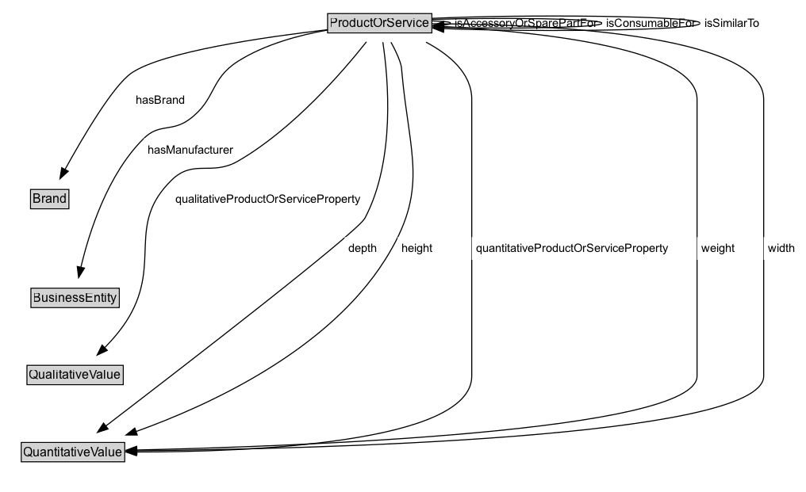

# ProductOrService

The superclass of all classes describing products or services types, either by nature or purpose. Examples for such subclasses are "TV set", "vacuum cleaner", etc. An instance of this class can be either an actual product or service (gr:Individual), a placeholder instance for unknown instances of a mass-produced commodity (gr:SomeItems), or a model / prototype specification (gr:ProductOrServiceModel). When in doubt, use gr:SomeItems.

Examples: 
a) MyCellphone123, i.e. my personal, tangible cell phone (gr:Individual)
b) Siemens1234, i.e. the Siemens cell phone make and model 1234 (gr:ProductOrServiceModel)
c) dummyCellPhone123 as a placeholder for actual instances of a certain kind of cell phones (gr:SomeItems)
	
Note: Your first choice for specializations of gr:ProductOrService should be http://www.productontology.org.

Compatibility with schema.org: This class is (approximately) equivalent to http://schema.org/Product.

## Diagram

=== "SVG (interactive)"

    <!-- Generated by graphviz version 14.1.3 (20260303.0454)
     -->
    <!-- Pages: 1 -->
    <svg width="762pt" height="466pt"
     viewBox="0.00 0.00 762.00 466.00" xmlns="http://www.w3.org/2000/svg" xmlns:xlink="http://www.w3.org/1999/xlink">
    <g id="graph0" class="graph" transform="scale(1 1) rotate(0) translate(4 462)">
    <polygon fill="white" stroke="none" points="-4,4 -4,-462 757.75,-462 757.75,4 -4,4"/>
    <g id="clust3" class="cluster">
    <title>cluster_associated</title>
    </g>
    <!-- ProductOrService -->
    <g id="node1" class="node">
    <title>ProductOrService</title>
    <g id="a_node1"><a xlink:href="../ProductOrService" xlink:title="&lt;TABLE&gt;">
    <polygon fill="lightgray" stroke="none" points="306.75,-431.88 306.75,-448.12 403.25,-448.12 403.25,-431.88 306.75,-431.88"/>
    <text xml:space="preserve" text-anchor="start" x="307.75" y="-435.88" font-family="Arial" font-size="12.00">ProductOrService</text>
    <polygon fill="none" stroke="black" points="305.75,-430.88 305.75,-449.12 404.25,-449.12 404.25,-430.88 305.75,-430.88"/>
    </a>
    </g>
    </g>
    <!-- ProductOrService&#45;&gt;ProductOrService -->
    <g id="edge10" class="edge">
    <title>ProductOrService&#45;&gt;ProductOrService</title>
    <path fill="none" stroke="black" d="M403.96,-442.21C414.56,-442 422.25,-441.26 422.25,-440 422.25,-439.25 419.54,-438.69 415.12,-438.31"/>
    <polygon fill="black" stroke="black" points="415.63,-434.83 405.48,-437.86 415.3,-441.82 415.63,-434.83"/>
    <polygon fill="white" stroke="none" points="422.25,-429.25 422.25,-450.75 565.25,-450.75 565.25,-429.25 422.25,-429.25"/>
    <text xml:space="preserve" text-anchor="start" x="426.25" y="-436.25" font-family="Arial" font-size="11.00">isAccessoryOrSparePartFor</text>
    </g>
    <!-- ProductOrService&#45;&gt;ProductOrService -->
    <g id="edge11" class="edge">
    <title>ProductOrService&#45;&gt;ProductOrService</title>
    <path fill="none" stroke="black" d="M404.09,-443.57C467.45,-445.65 565.25,-444.46 565.25,-440 565.25,-435.8 478.57,-434.5 415.55,-436.1"/>
    <polygon fill="black" stroke="black" points="415.5,-432.6 405.6,-436.39 415.7,-439.6 415.5,-432.6"/>
    <polygon fill="white" stroke="none" points="565.25,-429.25 565.25,-450.75 658,-450.75 658,-429.25 565.25,-429.25"/>
    <text xml:space="preserve" text-anchor="start" x="569.25" y="-436.25" font-family="Arial" font-size="11.00">isConsumableFor</text>
    </g>
    <!-- ProductOrService&#45;&gt;ProductOrService -->
    <g id="edge12" class="edge">
    <title>ProductOrService&#45;&gt;ProductOrService</title>
    <path fill="none" stroke="black" d="M403.97,-444.59C491.6,-448.71 658,-447.18 658,-440 658,-433.12 505.28,-431.43 415.41,-434.92"/>
    <polygon fill="black" stroke="black" points="415.32,-431.42 405.48,-435.35 415.62,-438.42 415.32,-431.42"/>
    <polygon fill="white" stroke="none" points="658,-429.25 658,-450.75 717.75,-450.75 717.75,-429.25 658,-429.25"/>
    <text xml:space="preserve" text-anchor="start" x="662" y="-436.25" font-family="Arial" font-size="11.00">isSimilarTo</text>
    </g>
    <!-- Invis -->
    <!-- ProductOrService&#45;&gt;Invis -->
    <!-- Brand -->
    <g id="node3" class="node">
    <title>Brand</title>
    <g id="a_node3"><a xlink:href="../Brand" xlink:title="&lt;TABLE&gt;">
    <polygon fill="lightgray" stroke="none" points="25.88,-265.38 25.88,-281.62 60.12,-281.62 60.12,-265.38 25.88,-265.38"/>
    <text xml:space="preserve" text-anchor="start" x="26.88" y="-269.38" font-family="Arial" font-size="12.00">Brand</text>
    <polygon fill="none" stroke="black" points="24.88,-264.38 24.88,-282.62 61.12,-282.62 61.12,-264.38 24.88,-264.38"/>
    </a>
    </g>
    </g>
    <!-- ProductOrService&#45;&gt;Brand -->
    <g id="edge7" class="edge">
    <title>ProductOrService&#45;&gt;Brand</title>
    <path fill="none" stroke="black" d="M305.89,-433.92C246.3,-426.98 150.13,-413.07 120.5,-393 103.13,-381.23 74.47,-332.47 57.29,-301.28"/>
    <polygon fill="black" stroke="black" points="60.52,-299.89 52.67,-292.79 54.38,-303.24 60.52,-299.89"/>
    <polygon fill="white" stroke="none" points="120.5,-356.25 120.5,-377.75 175,-377.75 175,-356.25 120.5,-356.25"/>
    <text xml:space="preserve" text-anchor="start" x="124.5" y="-363.25" font-family="Arial" font-size="11.00">hasBrand</text>
    </g>
    <!-- BusinessEntity -->
    <g id="node4" class="node">
    <title>BusinessEntity</title>
    <g id="a_node4"><a xlink:href="../BusinessEntity" xlink:title="&lt;TABLE&gt;">
    <polygon fill="lightgray" stroke="none" points="26.25,-171.88 26.25,-188.12 107.75,-188.12 107.75,-171.88 26.25,-171.88"/>
    <text xml:space="preserve" text-anchor="start" x="27.25" y="-175.88" font-family="Arial" font-size="12.00">BusinessEntity</text>
    <polygon fill="none" stroke="black" points="25.25,-170.88 25.25,-189.12 108.75,-189.12 108.75,-170.88 25.25,-170.88"/>
    </a>
    </g>
    </g>
    <!-- ProductOrService&#45;&gt;BusinessEntity -->
    <g id="edge8" class="edge">
    <title>ProductOrService&#45;&gt;BusinessEntity</title>
    <path fill="none" stroke="black" d="M305.91,-433.58C279.19,-428.88 246.49,-420.15 221,-404 194.08,-386.94 200.65,-367.91 175,-349 158.32,-336.7 146.74,-345.56 132,-331 97.65,-297.07 80.25,-242 72.44,-208.87"/>
    <polygon fill="black" stroke="black" points="75.88,-208.22 70.31,-199.21 69.05,-209.73 75.88,-208.22"/>
    <polygon fill="white" stroke="none" points="132,-309.5 132,-331 221,-331 221,-309.5 132,-309.5"/>
    <text xml:space="preserve" text-anchor="start" x="136" y="-316.5" font-family="Arial" font-size="11.00">hasManufacturer</text>
    </g>
    <!-- QualitativeValue -->
    <g id="node5" class="node">
    <title>QualitativeValue</title>
    <g id="a_node5"><a xlink:href="../QualitativeValue" xlink:title="&lt;TABLE&gt;">
    <polygon fill="lightgray" stroke="none" points="22.5,-98.88 22.5,-115.12 111.5,-115.12 111.5,-98.88 22.5,-98.88"/>
    <text xml:space="preserve" text-anchor="start" x="23.5" y="-102.88" font-family="Arial" font-size="12.00">QualitativeValue</text>
    <polygon fill="none" stroke="black" points="21.5,-97.88 21.5,-116.12 112.5,-116.12 112.5,-97.88 21.5,-97.88"/>
    </a>
    </g>
    </g>
    <!-- ProductOrService&#45;&gt;QualitativeValue -->
    <g id="edge13" class="edge">
    <title>ProductOrService&#45;&gt;QualitativeValue</title>
    <path fill="none" stroke="black" d="M342.46,-422.44C320.74,-394.91 273.39,-339.76 221,-309.5 195.88,-294.99 178.99,-311.79 158.25,-291.5 115.17,-249.35 148.42,-214.03 118,-162 111.85,-151.48 103.29,-141.37 94.94,-132.8"/>
    <polygon fill="black" stroke="black" points="97.43,-130.34 87.83,-125.84 92.53,-135.34 97.43,-130.34"/>
    <polygon fill="white" stroke="none" points="158.25,-262.75 158.25,-284.25 341,-284.25 341,-262.75 158.25,-262.75"/>
    <text xml:space="preserve" text-anchor="start" x="162.25" y="-269.75" font-family="Arial" font-size="11.00">qualitativeProductOrServiceProperty</text>
    </g>
    <!-- QuantitativeValue -->
    <g id="node6" class="node">
    <title>QuantitativeValue</title>
    <g id="a_node6"><a xlink:href="../QuantitativeValue" xlink:title="&lt;TABLE&gt;">
    <polygon fill="lightgray" stroke="none" points="17.12,-25.88 17.12,-42.12 112.88,-42.12 112.88,-25.88 17.12,-25.88"/>
    <text xml:space="preserve" text-anchor="start" x="18.12" y="-29.88" font-family="Arial" font-size="12.00">QuantitativeValue</text>
    <polygon fill="none" stroke="black" points="16.12,-24.88 16.12,-43.12 113.88,-43.12 113.88,-24.88 16.12,-24.88"/>
    </a>
    </g>
    </g>
    <!-- ProductOrService&#45;&gt;QuantitativeValue -->
    <g id="edge6" class="edge">
    <title>ProductOrService&#45;&gt;QuantitativeValue</title>
    <path fill="none" stroke="black" d="M357.96,-422.09C363,-388.22 370.13,-310.58 341,-255.5 333.76,-241.81 166.21,-112.52 95.76,-58.52"/>
    <polygon fill="black" stroke="black" points="98.15,-55.94 88.09,-52.64 93.9,-61.5 98.15,-55.94"/>
    <polygon fill="white" stroke="none" points="321.78,-216 321.78,-237.5 356.78,-237.5 356.78,-216 321.78,-216"/>
    <text xml:space="preserve" text-anchor="start" x="325.78" y="-223" font-family="Arial" font-size="11.00">depth</text>
    </g>
    <!-- ProductOrService&#45;&gt;QuantitativeValue -->
    <g id="edge9" class="edge">
    <title>ProductOrService&#45;&gt;QuantitativeValue</title>
    <path fill="none" stroke="black" d="M365.6,-422.06C368.71,-416.48 371.84,-410.13 374,-404 375.65,-399.31 375.55,-397.95 376,-393 383.09,-314.33 402.13,-282.81 360,-216 305.62,-129.77 193.73,-78.33 124.46,-53.45"/>
    <polygon fill="black" stroke="black" points="125.75,-50.19 115.15,-50.18 123.43,-56.79 125.75,-50.19"/>
    <polygon fill="white" stroke="none" points="371.95,-216 371.95,-237.5 409.2,-237.5 409.2,-216 371.95,-216"/>
    <text xml:space="preserve" text-anchor="start" x="375.95" y="-223" font-family="Arial" font-size="11.00">height</text>
    </g>
    <!-- ProductOrService&#45;&gt;QuantitativeValue -->
    <g id="edge14" class="edge">
    <title>ProductOrService&#45;&gt;QuantitativeValue</title>
    <path fill="none" stroke="black" d="M398.75,-422.08C420.42,-410.57 442,-392.86 442,-368 442,-368 442,-368 442,-106 442,-42.29 231.42,-34.15 125.02,-34.11"/>
    <polygon fill="black" stroke="black" points="125.02,-30.61 115.03,-34.13 125.04,-37.61 125.02,-30.61"/>
    <polygon fill="white" stroke="none" points="442,-216 442,-237.5 631.5,-237.5 631.5,-216 442,-216"/>
    <text xml:space="preserve" text-anchor="start" x="446" y="-223" font-family="Arial" font-size="11.00">quantitativeProductOrServiceProperty</text>
    </g>
    <!-- ProductOrService&#45;&gt;QuantitativeValue -->
    <g id="edge15" class="edge">
    <title>ProductOrService&#45;&gt;QuantitativeValue</title>
    <path fill="none" stroke="black" d="M404.2,-437.43C489.31,-433.37 655,-418.91 655,-368 655,-368 655,-368 655,-106 655,-53.02 275.19,-39.35 125.04,-36.02"/>
    <polygon fill="black" stroke="black" points="125.37,-32.52 115.3,-35.81 125.22,-39.52 125.37,-32.52"/>
    <polygon fill="white" stroke="none" points="655,-216 655,-237.5 694.5,-237.5 694.5,-216 655,-216"/>
    <text xml:space="preserve" text-anchor="start" x="659" y="-223" font-family="Arial" font-size="11.00">weight</text>
    </g>
    <!-- ProductOrService&#45;&gt;QuantitativeValue -->
    <g id="edge16" class="edge">
    <title>ProductOrService&#45;&gt;QuantitativeValue</title>
    <path fill="none" stroke="black" d="M403.96,-439.5C503.04,-439.2 718,-431.25 718,-368 718,-368 718,-368 718,-106 718,-46.66 286.38,-36.88 124.96,-35.3"/>
    <polygon fill="black" stroke="black" points="125.36,-31.8 115.33,-35.21 125.3,-38.8 125.36,-31.8"/>
    <polygon fill="white" stroke="none" points="718,-216 718,-237.5 751.5,-237.5 751.5,-216 718,-216"/>
    <text xml:space="preserve" text-anchor="start" x="722" y="-223" font-family="Arial" font-size="11.00">width</text>
    </g>
    <!-- Invis&#45;&gt;Brand -->
    <!-- Brand&#45;&gt;BusinessEntity -->
    <!-- BusinessEntity&#45;&gt;QualitativeValue -->
    <!-- QualitativeValue&#45;&gt;QuantitativeValue -->
    </g>
    </svg>

=== "PNG"

    

## Specializations of ProductOrService

| Class | Description |
|-------|-------------|
| [Actual Product Or Service Instance (deprecated)](ActualProductOrServiceInstance.md) | DEPRECATED - This class is superseded by gr:Individual. Replace all occurrences of gr:ActualProductOrServiceInstance by gr:Individual, if possible. |
| [Individual](Individual.md) | A gr:Individual is an actual product or service instance, i.e., a single identifiable object or action that creates some increase in utility (in the economic sense) for the individual possessing or using this very object (product) or for the individual in whose favor this very action is being taken (service). Products or services are types of goods in the economic sense. For an overview of goods and commodities in economics, see Milgate (1987).

Examples: MyThinkpad T60, the pint of beer standing in front of me, my Volkswagen Golf, the haircut that I received or will be receiving at a given date and time.

Note 1: In many cases, product or service instances are not explicitly exposed on the Web but only claimed to exist (i.e. existentially quantified). In this case, use gr:SomeItems.
Note 2: This class is the new, shorter form of the former gr:ActualProductOrServiceInstance.

Compatibility with schema.org: This class is a subclass of http://schema.org/Product. |
| [Product Or Service Model](ProductOrServiceModel.md) | A product or service model is a intangible entity that specifies some characteristics of a group of similar, usually mass-produced products, in the sense of a prototype. In case of mass-produced products, there exists a relation gr:hasMakeAndModel between the actual product or service (gr:Individual or gr:SomeItems) and the prototype (gr:ProductOrServiceModel). GoodRelations treats product or service models as "prototypes" instead of a completely separate kind of entities, because this allows using the same domain-specific properties (e.g. gr:weight) for describing makes and models and for describing actual products.

Examples: Ford T, Volkswagen Golf, Sony Ericsson W123 cell phone

Note: An actual product or service (gr:Individual) by default shares the features of its model (e.g. the weight). However, this requires non-standard reasoning. See http://wiki.goodrelations-vocabulary.org/Axioms for respective rule sets.
	
Compatibility with schema.org: This class is (approximately) a subclass of http://schema.org/Product. |
| [Product Or Services Some Instances Placeholder (deprecated)](ProductOrServicesSomeInstancesPlaceholder.md) | DEPRECATED - This class is superseded by gr:SomeItems. Replace all occurrences of gr:ProductOrServicesSomeInstancesPlaceholder by gr:SomeItems, if possible. |
| [Some Items](SomeItems.md) | A placeholder instance for unknown instances of a mass-produced commodity. This is used as a computationally cheap work-around for such instances that are not individually exposed on the Web but just stated to exist (i.e., which are existentially quantified).

Example: An instance of this class can represent an anonymous set of green Siemens1234 phones. It is different from the gr:ProductOrServiceModel Siemens1234, since this refers to the make and model, and it is different from a particular instance of this make and model (e.g. my individual phone) since the latter can be sold only once.

Note: This class is the new, shorter form of the former gr:ProductOrServicesSomeInstancesPlaceholder.
		
Compatibility with schema.org: This class is (approximately) a subclass of http://schema.org/Product. |

## Formalization for ProductOrService

| Property | Constraint |
|----------|------------|
| [category](../properties/category.md) | datatype rdfs:Literal |
| [color](../properties/color.md) | datatype rdfs:Literal |
| [condition](../properties/condition.md) | datatype rdfs:Literal |
| [datatypeProductOrServiceProperty](../properties/datatypeProductOrServiceProperty.md) | datatype rdfs:Literal |
| [depth](../properties/depth.md) | only [QuantitativeValue](http://purl.org/goodrelations/v1/QuantitativeValue) |
| [description](../properties/description.md) | datatype rdfs:Literal |
| [hasBrand](../properties/hasBrand.md) | only [Brand](http://purl.org/goodrelations/v1/Brand) |
| [hasEAN_UCC-13](../properties/hasEAN_UCC-13.md) | datatype xsd:string |
| [hasGTIN-14](../properties/hasGTIN-14.md) | datatype xsd:string |
| [hasGTIN-8](../properties/hasGTIN-8.md) | datatype xsd:string |
| [hasManufacturer](../properties/hasManufacturer.md) | only [BusinessEntity](http://purl.org/goodrelations/v1/BusinessEntity) |
| [hasMPN](../properties/hasMPN.md) | datatype xsd:string |
| [hasStockKeepingUnit](../properties/hasStockKeepingUnit.md) | datatype xsd:string |
| [height](../properties/height.md) | only [QuantitativeValue](http://purl.org/goodrelations/v1/QuantitativeValue) |
| [isAccessoryOrSparePartFor](../properties/isAccessoryOrSparePartFor.md) | only [ProductOrService](http://purl.org/goodrelations/v1/ProductOrService) |
| [isConsumableFor](../properties/isConsumableFor.md) | only [ProductOrService](http://purl.org/goodrelations/v1/ProductOrService) |
| [isSimilarTo](../properties/isSimilarTo.md) | only [ProductOrService](http://purl.org/goodrelations/v1/ProductOrService) |
| [name](../properties/name.md) | datatype rdfs:Literal |
| [qualitativeProductOrServiceProperty](../properties/qualitativeProductOrServiceProperty.md) | only [QualitativeValue](http://purl.org/goodrelations/v1/QualitativeValue) |
| [quantitativeProductOrServiceProperty](../properties/quantitativeProductOrServiceProperty.md) | only [QuantitativeValue](http://purl.org/goodrelations/v1/QuantitativeValue) |
| [weight](../properties/weight.md) | only [QuantitativeValue](http://purl.org/goodrelations/v1/QuantitativeValue) |
| [width](../properties/width.md) | only [QuantitativeValue](http://purl.org/goodrelations/v1/QuantitativeValue) |
| disjointWith | [Brand](Brand.md) |
| disjointWith | [BusinessEntityType](BusinessEntityType.md) |
| disjointWith | [BusinessFunction](BusinessFunction.md) |
| disjointWith | [DayOfWeek](DayOfWeek.md) |
| disjointWith | [DeliveryMethod](DeliveryMethod.md) |
| disjointWith | [Offering](Offering.md) |
| disjointWith | [OpeningHoursSpecification](OpeningHoursSpecification.md) |
| disjointWith | [PriceSpecification](PriceSpecification.md) |
| disjointWith | [QuantitativeValue](QuantitativeValue.md) |
| disjointWith | [TypeAndQuantityNode](TypeAndQuantityNode.md) |
| disjointWith | [WarrantyPromise](WarrantyPromise.md) |
| disjointWith | [WarrantyScope](WarrantyScope.md) |

