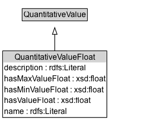

# QuantitativeValueFloat

An instance of this class is an actual float value for a quantitative property of a product. This instance is usually characterized by a minimal value, a maximal value, and a unit of measurement.

Examples: The intervals "between 10.0  and 25.4 kilogramms" or "10.2 and 15.5 milimeters".

Compatibility with schema.org: This class is a subclass of http://schema.org/Quantity.

## Diagram

=== "SVG (interactive)"

    <!-- Generated by graphviz version 14.1.3 (20260303.0454)
     -->
    <!-- Pages: 1 -->
    <svg width="252pt" height="180pt"
     viewBox="0.00 0.00 252.00 180.00" xmlns="http://www.w3.org/2000/svg" xmlns:xlink="http://www.w3.org/1999/xlink">
    <g id="graph0" class="graph" transform="scale(1 1) rotate(0) translate(4 175.5)">
    <polygon fill="white" stroke="none" points="-4,4 -4,-175.5 248.12,-175.5 248.12,4 -4,4"/>
    <g id="clust3" class="cluster">
    <title>cluster_associated</title>
    </g>
    <!-- QuantitativeValue -->
    <g id="node1" class="node">
    <title>QuantitativeValue</title>
    <g id="a_node1"><a xlink:href="../QuantitativeValue" xlink:title="&lt;TABLE&gt;">
    <polygon fill="lightgray" stroke="none" points="30.25,-145.38 30.25,-161.62 126,-161.62 126,-145.38 30.25,-145.38"/>
    <text xml:space="preserve" text-anchor="start" x="31.25" y="-149.38" font-family="Arial" font-size="12.00">QuantitativeValue</text>
    <polygon fill="none" stroke="black" points="29.25,-144.38 29.25,-162.62 127,-162.62 127,-144.38 29.25,-144.38"/>
    </a>
    </g>
    </g>
    <!-- QuantitativeValueFloat -->
    <g id="node2" class="node">
    <title>QuantitativeValueFloat</title>
    <g id="a_node2"><a xlink:href="../QuantitativeValueFloat" xlink:title="&lt;TABLE&gt;">
    <polygon fill="lightgray" stroke="none" points="1,-82.25 1,-98.5 155.25,-98.5 155.25,-82.25 1,-82.25"/>
    <text xml:space="preserve" text-anchor="start" x="17.75" y="-86.25" font-family="Arial" font-size="12.00">QuantitativeValueFloat</text>
    <text xml:space="preserve" text-anchor="start" x="2" y="-70" font-family="Arial" font-size="12.00">description : rdfs:Literal</text>
    <text xml:space="preserve" text-anchor="start" x="2" y="-53.75" font-family="Arial" font-size="12.00">hasMaxValueFloat : xsd:float</text>
    <text xml:space="preserve" text-anchor="start" x="2" y="-37.5" font-family="Arial" font-size="12.00">hasMinValueFloat : xsd:float</text>
    <text xml:space="preserve" text-anchor="start" x="2" y="-21.25" font-family="Arial" font-size="12.00">hasValueFloat : xsd:float</text>
    <text xml:space="preserve" text-anchor="start" x="2" y="-5" font-family="Arial" font-size="12.00">name : rdfs:Literal</text>
    <polygon fill="none" stroke="black" points="0,0 0,-99.5 156.25,-99.5 156.25,0 0,0"/>
    </a>
    </g>
    </g>
    <!-- QuantitativeValueFloat&#45;&gt;QuantitativeValue -->
    <g id="edge1" class="edge">
    <title>QuantitativeValueFloat&#45;&gt;QuantitativeValue</title>
    <path fill="none" stroke="black" d="M78.12,-99.21C78.12,-107.81 78.12,-116.51 78.12,-124.32"/>
    <polygon fill="none" stroke="black" points="74.63,-124.18 78.13,-134.18 81.63,-124.18 74.63,-124.18"/>
    </g>
    <!-- Invis -->
    </g>
    </svg>

=== "PNG"

    

## Formalization for QuantitativeValueFloat

| Property | Constraint |
|----------|------------|
| [description](../properties/description.md) | datatype rdfs:Literal |
| [hasMaxValueFloat](../properties/hasMaxValueFloat.md) | datatype xsd:float |
| [hasMinValueFloat](../properties/hasMinValueFloat.md) | datatype xsd:float |
| [hasValueFloat](../properties/hasValueFloat.md) | datatype xsd:float |
| [name](../properties/name.md) | datatype rdfs:Literal |
| disjointWith | [QuantitativeValueInteger](QuantitativeValueInteger.md) |
| subClassOf | [QuantitativeValue](QuantitativeValue.md) |

