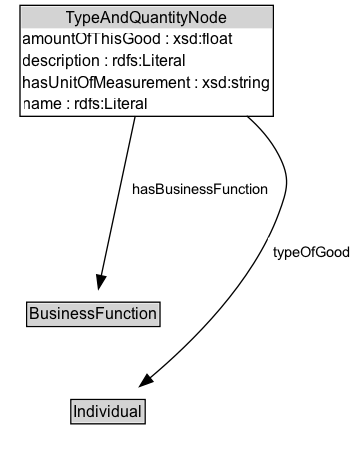

# TypeAndQuantityNode

This class collates all the information about a gr:ProductOrService included in a bundle. If a gr:Offering contains just one item, you can directly link from the gr:Offering to the gr:ProductOrService using gr:includes. If the offering contains multiple items, use an instance of this class for each component to indicate the quantity, unit of measurement, and type of product, and link from the gr:Offering via gr:includesObject.

Example: An offering may include of 100g of Butter and 1 kg of potatoes, or 1 cell phone and 2 headsets.

## Diagram

=== "SVG (interactive)"

    <!-- Generated by graphviz version 14.1.3 (20260303.0454)
     -->
    <!-- Pages: 1 -->
    <svg width="271pt" height="347pt"
     viewBox="0.00 0.00 271.00 347.00" xmlns="http://www.w3.org/2000/svg" xmlns:xlink="http://www.w3.org/1999/xlink">
    <g id="graph0" class="graph" transform="scale(1 1) rotate(0) translate(4 342.75)">
    <polygon fill="white" stroke="none" points="-4,4 -4,-342.75 266.68,-342.75 266.68,4 -4,4"/>
    <g id="clust3" class="cluster">
    <title>cluster_associated</title>
    </g>
    <!-- TypeAndQuantityNode -->
    <g id="node1" class="node">
    <title>TypeAndQuantityNode</title>
    <g id="a_node1"><a xlink:href="../TypeAndQuantityNode" xlink:title="&lt;TABLE&gt;">
    <polygon fill="lightgray" stroke="none" points="12,-321.5 12,-337.75 200,-337.75 200,-321.5 12,-321.5"/>
    <text xml:space="preserve" text-anchor="start" x="45.25" y="-325.5" font-family="Arial" font-size="12.00">TypeAndQuantityNode</text>
    <text xml:space="preserve" text-anchor="start" x="13" y="-309.25" font-family="Arial" font-size="12.00">amountOfThisGood : xsd:float</text>
    <text xml:space="preserve" text-anchor="start" x="13" y="-293" font-family="Arial" font-size="12.00">description : rdfs:Literal</text>
    <text xml:space="preserve" text-anchor="start" x="13" y="-276.75" font-family="Arial" font-size="12.00">hasUnitOfMeasurement : xsd:string</text>
    <text xml:space="preserve" text-anchor="start" x="13" y="-260.5" font-family="Arial" font-size="12.00">name : rdfs:Literal</text>
    <polygon fill="none" stroke="black" points="11,-255.5 11,-338.75 201,-338.75 201,-255.5 11,-255.5"/>
    </a>
    </g>
    </g>
    <!-- Invis -->
    <!-- TypeAndQuantityNode&#45;&gt;Invis -->
    <!-- BusinessFunction -->
    <g id="node3" class="node">
    <title>BusinessFunction</title>
    <g id="a_node3"><a xlink:href="../BusinessFunction" xlink:title="&lt;TABLE&gt;">
    <polygon fill="lightgray" stroke="none" points="17,-98.88 17,-115.12 115,-115.12 115,-98.88 17,-98.88"/>
    <text xml:space="preserve" text-anchor="start" x="18" y="-102.88" font-family="Arial" font-size="12.00">BusinessFunction</text>
    <polygon fill="none" stroke="black" points="16,-97.88 16,-116.12 116,-116.12 116,-97.88 16,-97.88"/>
    </a>
    </g>
    </g>
    <!-- TypeAndQuantityNode&#45;&gt;BusinessFunction -->
    <g id="edge4" class="edge">
    <title>TypeAndQuantityNode&#45;&gt;BusinessFunction</title>
    <path fill="none" stroke="black" d="M97.42,-255.77C89.72,-219.58 78.64,-167.45 71.9,-135.75"/>
    <polygon fill="black" stroke="black" points="75.36,-135.21 69.86,-126.16 68.52,-136.67 75.36,-135.21"/>
    <polygon fill="white" stroke="none" points="90.95,-189.75 90.95,-211.25 200.95,-211.25 200.95,-189.75 90.95,-189.75"/>
    <text xml:space="preserve" text-anchor="start" x="94.95" y="-196.75" font-family="Arial" font-size="11.00">hasBusinessFunction</text>
    </g>
    <!-- Individual -->
    <g id="node4" class="node">
    <title>Individual</title>
    <g id="a_node4"><a xlink:href="../Individual" xlink:title="&lt;TABLE&gt;">
    <polygon fill="lightgray" stroke="none" points="50.12,-25.88 50.12,-42.12 103.88,-42.12 103.88,-25.88 50.12,-25.88"/>
    <text xml:space="preserve" text-anchor="start" x="51.12" y="-29.88" font-family="Arial" font-size="12.00">Individual</text>
    <polygon fill="none" stroke="black" points="49.12,-24.88 49.12,-43.12 104.88,-43.12 104.88,-24.88 49.12,-24.88"/>
    </a>
    </g>
    </g>
    <!-- TypeAndQuantityNode&#45;&gt;Individual -->
    <g id="edge5" class="edge">
    <title>TypeAndQuantityNode&#45;&gt;Individual</title>
    <path fill="none" stroke="black" d="M181.02,-255.86C190.67,-247.46 199.19,-237.69 205,-226.5 214.01,-209.14 211.78,-200.84 205,-182.5 185.97,-130.97 139.76,-85.59 108.4,-59.21"/>
    <polygon fill="black" stroke="black" points="110.7,-56.58 100.75,-52.93 106.26,-61.98 110.7,-56.58"/>
    <polygon fill="white" stroke="none" points="196.93,-143 196.93,-164.5 262.68,-164.5 262.68,-143 196.93,-143"/>
    <text xml:space="preserve" text-anchor="start" x="200.93" y="-150" font-family="Arial" font-size="11.00">typeOfGood</text>
    </g>
    <!-- Invis&#45;&gt;BusinessFunction -->
    <!-- BusinessFunction&#45;&gt;Individual -->
    </g>
    </svg>

=== "PNG"

    

## Formalization for TypeAndQuantityNode

| Property | Constraint |
|----------|------------|
| [amountOfThisGood](../properties/amountOfThisGood.md) | datatype xsd:float |
| [description](../properties/description.md) | datatype rdfs:Literal |
| [hasBusinessFunction](../properties/hasBusinessFunction.md) | only [BusinessFunction](http://purl.org/goodrelations/v1/BusinessFunction) |
| [hasUnitOfMeasurement](../properties/hasUnitOfMeasurement.md) | datatype xsd:string |
| [name](../properties/name.md) | datatype rdfs:Literal |
| [typeOfGood](../properties/typeOfGood.md) | only [Individual](http://purl.org/goodrelations/v1/Individual); only [SomeItems](http://purl.org/goodrelations/v1/SomeItems) |
| disjointWith | [Brand](Brand.md) |
| disjointWith | [BusinessEntity](BusinessEntity.md) |
| disjointWith | [BusinessEntityType](BusinessEntityType.md) |
| disjointWith | [BusinessFunction](BusinessFunction.md) |
| disjointWith | [DayOfWeek](DayOfWeek.md) |
| disjointWith | [DeliveryMethod](DeliveryMethod.md) |
| disjointWith | [Location](Location.md) |
| disjointWith | [Offering](Offering.md) |
| disjointWith | [OpeningHoursSpecification](OpeningHoursSpecification.md) |
| disjointWith | [PaymentMethod](PaymentMethod.md) |
| disjointWith | [PriceSpecification](PriceSpecification.md) |
| disjointWith | [ProductOrService](ProductOrService.md) |
| disjointWith | [QualitativeValue](QualitativeValue.md) |
| disjointWith | [QuantitativeValue](QuantitativeValue.md) |
| disjointWith | [WarrantyPromise](WarrantyPromise.md) |
| disjointWith | [WarrantyScope](WarrantyScope.md) |

