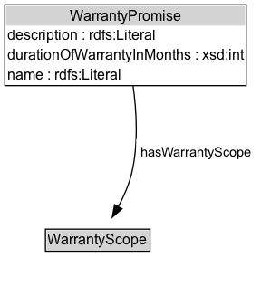

# WarrantyPromise

This is a conceptual entity that holds together all aspects of the n-ary relation gr:hasWarrantyPromise.

A Warranty promise is an entity representing the duration and scope of services that will be provided to a customer free of charge in case of a defect or malfunction of the gr:ProductOrService. A warranty promise is characterized by its temporal duration (usually starting with the date of purchase) and its gr:WarrantyScope. The warranty scope represents the types of services provided (e.g. labor and parts, just parts) of the warranty included in an gr:Offering. The actual services may be provided by the gr:BusinessEntity making the offering, by the manufacturer of the product, or by a third party. There may be multiple warranty promises associated with a particular offering, which differ in duration and scope (e.g. pick-up service during the first 12 months, just parts and labor for 36 months).

Examples: 12 months parts and labor, 36 months parts

## Diagram

=== "SVG (interactive)"

    <!-- Generated by graphviz version 14.1.3 (20260303.0454)
     -->
    <!-- Pages: 1 -->
    <svg width="216pt" height="237pt"
     viewBox="0.00 0.00 216.00 237.00" xmlns="http://www.w3.org/2000/svg" xmlns:xlink="http://www.w3.org/1999/xlink">
    <g id="graph0" class="graph" transform="scale(1 1) rotate(0) translate(4 233)">
    <polygon fill="white" stroke="none" points="-4,4 -4,-233 212.29,-233 212.29,4 -4,4"/>
    <g id="clust3" class="cluster">
    <title>cluster_associated</title>
    </g>
    <!-- WarrantyPromise -->
    <g id="node1" class="node">
    <title>WarrantyPromise</title>
    <g id="a_node1"><a xlink:href="../WarrantyPromise" xlink:title="&lt;TABLE&gt;">
    <polygon fill="lightgray" stroke="none" points="1,-211.75 1,-228 198.75,-228 198.75,-211.75 1,-211.75"/>
    <text xml:space="preserve" text-anchor="start" x="53.75" y="-215.75" font-family="Arial" font-size="12.00">WarrantyPromise</text>
    <text xml:space="preserve" text-anchor="start" x="2" y="-199.5" font-family="Arial" font-size="12.00">description : rdfs:Literal</text>
    <text xml:space="preserve" text-anchor="start" x="2" y="-183.25" font-family="Arial" font-size="12.00">durationOfWarrantyInMonths : xsd:int</text>
    <text xml:space="preserve" text-anchor="start" x="2" y="-167" font-family="Arial" font-size="12.00">name : rdfs:Literal</text>
    <polygon fill="none" stroke="black" points="0,-162 0,-229 199.75,-229 199.75,-162 0,-162"/>
    </a>
    </g>
    </g>
    <!-- Invis -->
    <!-- WarrantyPromise&#45;&gt;Invis -->
    <!-- WarrantyScope -->
    <g id="node3" class="node">
    <title>WarrantyScope</title>
    <g id="a_node3"><a xlink:href="../WarrantyScope" xlink:title="&lt;TABLE&gt;">
    <polygon fill="lightgray" stroke="none" points="34.62,-25.88 34.62,-42.12 119.12,-42.12 119.12,-25.88 34.62,-25.88"/>
    <text xml:space="preserve" text-anchor="start" x="35.62" y="-29.88" font-family="Arial" font-size="12.00">WarrantyScope</text>
    <polygon fill="none" stroke="black" points="33.62,-24.88 33.62,-43.12 120.12,-43.12 120.12,-24.88 33.62,-24.88"/>
    </a>
    </g>
    </g>
    <!-- WarrantyPromise&#45;&gt;WarrantyScope -->
    <g id="edge3" class="edge">
    <title>WarrantyPromise&#45;&gt;WarrantyScope</title>
    <path fill="none" stroke="black" d="M106.1,-162.19C109.03,-141.07 110.74,-113.05 104.88,-89 102.59,-79.62 98.36,-70.06 93.88,-61.63"/>
    <polygon fill="black" stroke="black" points="96.94,-59.93 88.93,-52.99 90.86,-63.41 96.94,-59.93"/>
    <polygon fill="white" stroke="none" points="108.79,-96.25 108.79,-117.75 208.29,-117.75 208.29,-96.25 108.79,-96.25"/>
    <text xml:space="preserve" text-anchor="start" x="112.79" y="-103.25" font-family="Arial" font-size="11.00">hasWarrantyScope</text>
    </g>
    <!-- Invis&#45;&gt;WarrantyScope -->
    </g>
    </svg>

=== "PNG"

    

## Formalization for WarrantyPromise

| Property | Constraint |
|----------|------------|
| [description](../properties/description.md) | datatype rdfs:Literal |
| [durationOfWarrantyInMonths](../properties/durationOfWarrantyInMonths.md) | datatype xsd:int |
| [hasWarrantyScope](../properties/hasWarrantyScope.md) | only [WarrantyScope](http://purl.org/goodrelations/v1/WarrantyScope) |
| [name](../properties/name.md) | datatype rdfs:Literal |
| disjointWith | [Brand](Brand.md) |
| disjointWith | [BusinessEntity](BusinessEntity.md) |
| disjointWith | [BusinessEntityType](BusinessEntityType.md) |
| disjointWith | [BusinessFunction](BusinessFunction.md) |
| disjointWith | [DayOfWeek](DayOfWeek.md) |
| disjointWith | [DeliveryMethod](DeliveryMethod.md) |
| disjointWith | [Location](Location.md) |
| disjointWith | [Offering](Offering.md) |
| disjointWith | [OpeningHoursSpecification](OpeningHoursSpecification.md) |
| disjointWith | [PaymentMethod](PaymentMethod.md) |
| disjointWith | [PriceSpecification](PriceSpecification.md) |
| disjointWith | [ProductOrService](ProductOrService.md) |
| disjointWith | [QuantitativeValue](QuantitativeValue.md) |
| disjointWith | [TypeAndQuantityNode](TypeAndQuantityNode.md) |
| disjointWith | [WarrantyScope](WarrantyScope.md) |

