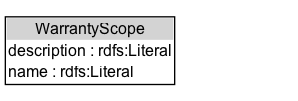

# WarrantyScope

The warranty scope represents types of services that will be provided free of charge by the vendor or manufacturer in the case of a defect (e.g. labor and parts, just parts), as part of the warranty included in an gr:Offering. The actual services may be provided by the gr:BusinessEntity making the offering, by the manufacturer of the product, or by a third party. 

Examples: Parts and Labor, Parts

## Diagram

=== "SVG (interactive)"

    <!-- Generated by graphviz version 14.1.3 (20260303.0454)
     -->
    <!-- Pages: 1 -->
    <svg width="224pt" height="76pt"
     viewBox="0.00 0.00 224.00 76.00" xmlns="http://www.w3.org/2000/svg" xmlns:xlink="http://www.w3.org/1999/xlink">
    <g id="graph0" class="graph" transform="scale(1 1) rotate(0) translate(4 72)">
    <polygon fill="white" stroke="none" points="-4,4 -4,-72 219.5,-72 219.5,4 -4,4"/>
    <g id="clust3" class="cluster">
    <title>cluster_associated</title>
    </g>
    <!-- WarrantyScope -->
    <g id="node1" class="node">
    <title>WarrantyScope</title>
    <g id="a_node1"><a xlink:href="../WarrantyScope" xlink:title="&lt;TABLE&gt;">
    <polygon fill="lightgray" stroke="none" points="1,-42.12 1,-58.38 126,-58.38 126,-42.12 1,-42.12"/>
    <text xml:space="preserve" text-anchor="start" x="22.25" y="-46.12" font-family="Arial" font-size="12.00">WarrantyScope</text>
    <text xml:space="preserve" text-anchor="start" x="2" y="-29.88" font-family="Arial" font-size="12.00">description : rdfs:Literal</text>
    <text xml:space="preserve" text-anchor="start" x="2" y="-13.62" font-family="Arial" font-size="12.00">name : rdfs:Literal</text>
    <polygon fill="none" stroke="black" points="0,-8.62 0,-59.38 127,-59.38 127,-8.62 0,-8.62"/>
    </a>
    </g>
    </g>
    <!-- Invis -->
    </g>
    </svg>

=== "PNG"

    

## Formalization for WarrantyScope

| Property | Constraint |
|----------|------------|
| [description](../properties/description.md) | datatype rdfs:Literal |
| [name](../properties/name.md) | datatype rdfs:Literal |
| disjointWith | [Brand](Brand.md) |
| disjointWith | [BusinessEntity](BusinessEntity.md) |
| disjointWith | [BusinessEntityType](BusinessEntityType.md) |
| disjointWith | [BusinessFunction](BusinessFunction.md) |
| disjointWith | [DayOfWeek](DayOfWeek.md) |
| disjointWith | [DeliveryMethod](DeliveryMethod.md) |
| disjointWith | [Location](Location.md) |
| disjointWith | [Offering](Offering.md) |
| disjointWith | [OpeningHoursSpecification](OpeningHoursSpecification.md) |
| disjointWith | [PaymentMethod](PaymentMethod.md) |
| disjointWith | [PriceSpecification](PriceSpecification.md) |
| disjointWith | [ProductOrService](ProductOrService.md) |
| disjointWith | [QuantitativeValue](QuantitativeValue.md) |
| disjointWith | [TypeAndQuantityNode](TypeAndQuantityNode.md) |
| disjointWith | [WarrantyPromise](WarrantyPromise.md) |

